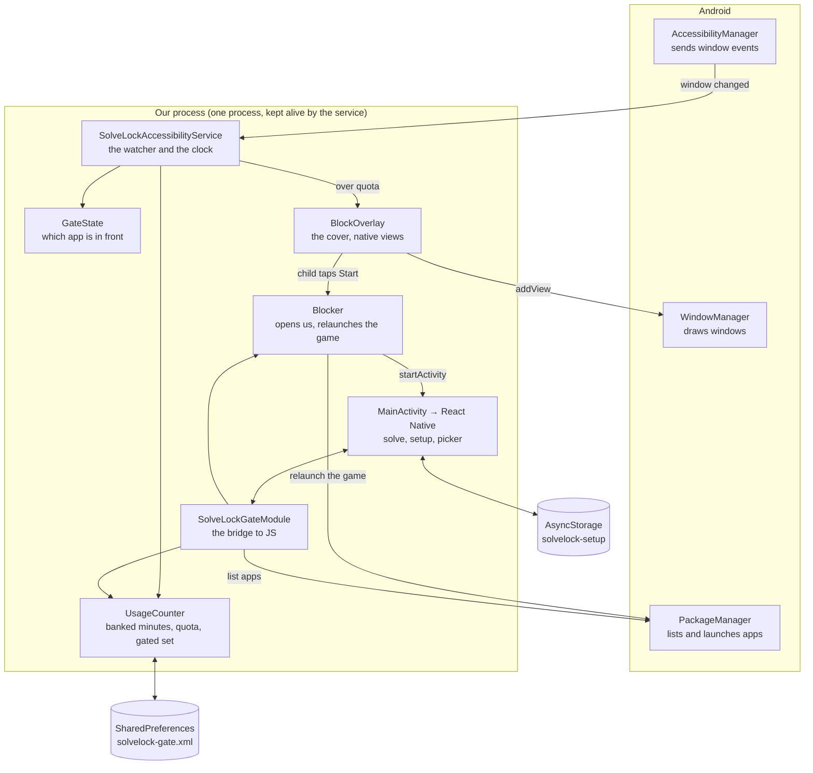
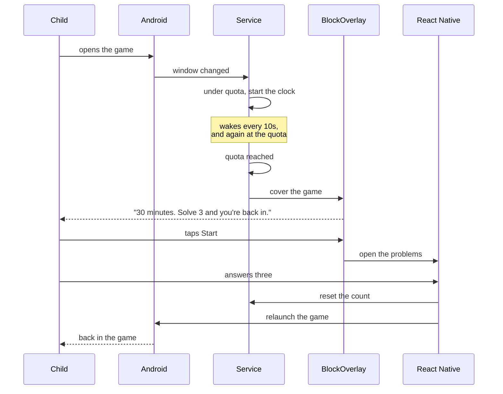

# How the Android side works

Written in ASD-STE100 Simplified Technical English. This describes what we
built. For why each milestone exists, see [android-plan.md](android-plan.md).

Android has no Screen Time API. The operating system blocks nothing for us. We
watch, we count, and we cover.

## The parts

## The loop the child sees

## The four jobs

### 1. Know which app is in front

An accessibility service receives a window-change event the instant the
foreground window changes. Android binds it and keeps it alive, so we need no
foreground service, no permanent notification, and no polling.

Measured: below one second, same second as the launch.

### 2. Count the minutes

`UsageCounter` holds one total and one timestamp.

- **Banked** (`usedMillis`) -- sessions that finished. In memory and on disk.
- **In session** (`since`) -- when the current session started. Memory only.

The number the child has spent is `usedMillis + (now - since)`.

Window events cannot enforce a quota, because they fire when a window changes
and not when the quota runs out. So the service keeps its own clock: it wakes
at the quota, or every ten seconds to write progress to disk, whichever comes
first. The ten-second write is also what keeps a crash cheap -- the session in
progress lives only in memory, and a flush turns it into banked minutes.

Measured: on a 60,000ms quota with the app untouched, the cover landed at
60,057ms.

### 3. Cover the game

**Not with an Activity.** A launch is a sequence of Activity starts -- Chrome's
launcher Activity starts its splash 108ms after our cover -- and the last start
wins. Games have longer launch chains than Chrome, not shorter.

`BlockOverlay` adds a window instead, with `TYPE_APPLICATION_OVERLAY`. Every
window of that type sits above every Activity, so the game can start as many as
it likes underneath and none of them reach the front. There is no race.

The cover is native Android views, not React Native: the service has no
Activity, no `ReactRootView`, and no JavaScript. So the same screen exists twice
-- in Kotlin for Android and in `app/blocked.tsx` for iOS -- and its colours are
a copy of `theme/color.tsx` that will drift.

The cover hides when any app we do not gate comes to the front. **Home still
works.** We gate an app; we do not cage a child.

### 4. Hand off, and hand back

The child taps Start. We open our Activity and the problems appear. After the
third answer we reset the count, clear the flag, and launch the game by name.

iOS can do neither of these: `ShieldActionResponse` has no "open the parent
app", and a selection token cannot launch anything. On Android both seams
disappear.

## Two stores, and why

| | Holds | Read by |
| --- | --- | --- |
| `AsyncStorage` | the parent's choices, for the screens | React Native |
| `SharedPreferences` | the same choices, plus the count | the service |

The service must work when no screen is open and no JavaScript is running, so
it cannot read AsyncStorage. `app/_layout.tsx` pushes the gated set and the
quota into the native copy whenever they change.

This is a real duplication. If the two ever disagree, the native copy is the
one that enforces.

## The three permissions

| | What it buys |
| --- | --- |
| Accessibility service | the window events, and a process Android keeps alive |
| Display over other apps | the cover window, **and** the right to start an Activity from the background |
| Ignore battery optimisation | a request, not a guarantee, that Android leaves us running |

The second one does two jobs. Android logs the second as
`BAL_ALLOW_SAW_PERMISSION` when we launch ourselves.

We do **not** ask for app usage access. We declared it once and never used it,
because the foreground app comes from the accessibility service. Every trip
into Android settings is a chance the parent gives up.

## What is not solved

- **Survival.** Everything rests on Android keeping the service bound. Samsung
  and Xiaomi kill harder than a Pixel, and the failure is silent: no crash, no
  warning, the cover simply never appears. This is A7.
- **After a reboot, before the first unlock**, our data is encrypted and the
  service cannot bind. Nothing is gated in that window. It closes when the
  child unlocks, which they must do to play.
- **The cover can land mid-match.** It now lands exactly on the quota, which is
  the precise half of the problem. Landing at a *kind* moment is still open,
  and [kid-experience.md](kid-experience.md) principle 1 calls that the whole
  ballgame.
- **The child cannot see the count** outside the settings test harness, and
  cannot solve early to buy time (principle 4).
